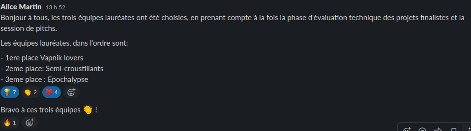
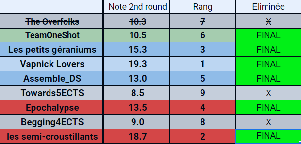

<h2>2nd Artificial Intelligence & Data Science Challenge</h2>

organised by the <a href="https://www.polytechnique.edu/">Ecole Polytechnique</a> and the <a href="https://www.carrefour.com/fr">Carrefour</a> DataLab (2nd Hackathon of the <a href="https://www.polytechnique.edu/fondation/content/carrefour-l%E2%80%99x-et-la-fx-cr%C3%A9ent-la-chaire-%C2%AB-next-gen-retail-%C2%BB">Next Gen RetAIl Carrefour Chaire</a>)

 

  

<h3>Context</h3>
This hackathon has been organised by the 1st French Retailer Carrefour (9th worldwide) and Ecole Polytechnique, which is a school from the Institut Polytechnique de Paris (IP Paris) (a public higher education and research institution that brings together five prestigious French engineering schools).  
 
More details about IP Paris <a href="https://www.ip-paris.fr/en/home-en/">here</a>.
 
 
The objective of this challenge was to understand an end-to-end data science project, from the exact definition of the problem, through cleaning and data processing phase, implementation of machine learning algorithms, to get a functional proof of concept.  
 
More details about the hackathon <a href="https://www.polytechnique.edu/en/content/new-edition-carrefour-chair-hackathon">here</a>.
 
The use case we have been working on from the three proposed :  

<b>Local Marketing Mix Modelling   
  Analysis, prediction of the impact of marketing media, levers on offline and online sales.</b>

<h3>Key figures</h3>
<ul>
  <li><b>Duration</b> : 10 weeks of competition from 3rd February to 8th April (*Delayed closing event (coronavirus)).</li>
  <li><b>Participants</b> : 132 students spread across 26 Teams, with 4 to 6 members in each team.</li>
  <li><b>Data</b> : 30 Datasets with 20 KPI.</li>
  <li><b>Environment</b> : GCP's Virtual Machines, BigQuery and Python. 
</ul>

<h3>Results</h3>

  :trophy: <b>First rank</b> :trophy:
  

<h3>Main stages</h3>

<ul>
  <li><b>Update 0 - 03.02.2020</b> : Beginning of the Hackathon :checkered_flag:
  <li><b>Update 1 - 21.02.2020</b> : Vapnik Lovers is one of the 12 selected teams out of 26 for the second round of the Hackathon. </li>
  <li><b>Update 2 - 05.03.2020</b> : Vapnik Lovers selected for the final round of the Hackathon.</li>
  <li><b>Update 3 - 05.03.2020</b> : Closing day postponed from Saturday 7th March to Thursday 12th March 2020.</li>
  <li><b>Update 4 - 17.03.2020</b> : Vapnik Lovers received the best score for the technical evaluation (2nd round).</li>
  <li><b>Update 5 - 08.04.2020</b> : Final business pitch in front of Carrefour's Executive boards for the 6 best teams.</li>
  <li><b>Update 6 - 14.04.2020</b> : Winner Announcement.</li> 
</ul>

Award Finalists and Winner Announcement

  

Score and Ranking Board for the technical evaluation the second round

  

<h3>Our team</h3>

<b>THE VAPNIK LOVERS :rocket:</b>

 
All the members are students of the Post-Master's Degree in Big Data (Promotion 2019-2020) at Telecom Paris (an IP Paris school). 
 
 
Full curriculum and details of our degree <a href="https://www.telecom-paris.fr/en/post-masters-degree/all-post-masters-degree/post-masters-degree-in-big-data">here</a>.
 
 
Team members :

| First Header  | Second Header |
| ------------- | ------------- |
| Content Cell  | Content Cell  |
| Content Cell  | Content Cell  |

<table class="tg">
  <tr>
    <th class="tg-amwm">Name</th>
    <th class="tg-amwm">Github</th>
  </tr>
  <tr>
    <td class="tg-baqh">Camille COCHENER</td>
    <td class="tg-baqh"><a href="http://github.com/camillecochener">camillecochener</a></td>
  </tr>
  <tr>
    <td class="tg-baqh">Jérémie PERES</td>
    <td class="tg-baqh"><a href="http://github.com/jeremieperes">jeremieperes</a></td>
  </tr>
  <tr>
    <td class="tg-baqh">Vincent RICHARD</td>
    <td class="tg-baqh"><a href="http://github.com/vincrichard">vincrichard</a></td>
  </tr>
  <tr>
    <td class="tg-baqh">Thomas RIVIERE</td>
    <td class="tg-baqh"><a href="http://github.com/t-riviere">t-riviere</a></td>
  </tr>
  <tr>
    <td class="tg-baqh">Léa WU</td>
    <td class="tg-baqh"><a href="http://github.com/lilawu">lilawu</a></td>
  </tr>
  <tr>
    <td class="tg-baqh">Hiroto YAMAKAWA</td>
    <td class="tg-baqh"><a href="http://github.com/yamhiroto">yamhiroto</a></td>
  </tr>
</table>

### As agreed with Carrefour, Data and notebooks won't be published in this repository. Only our last presentation will be available at the end of the challenge, after further approval from the company.

